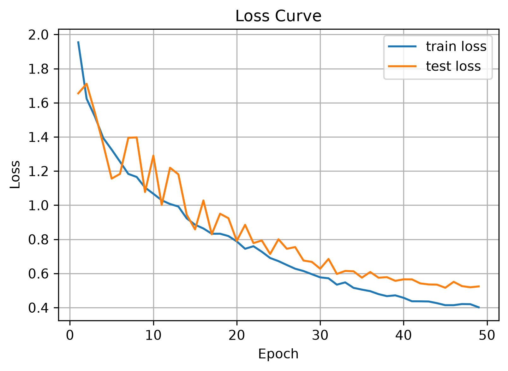
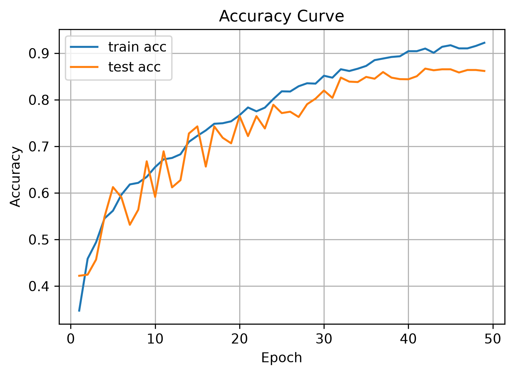
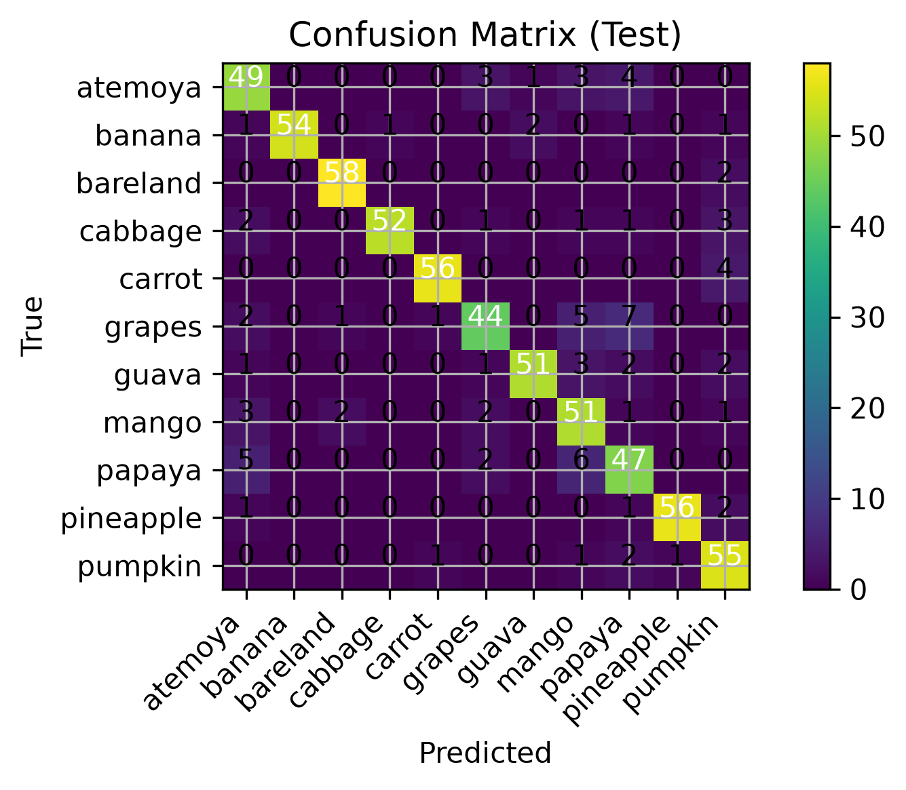
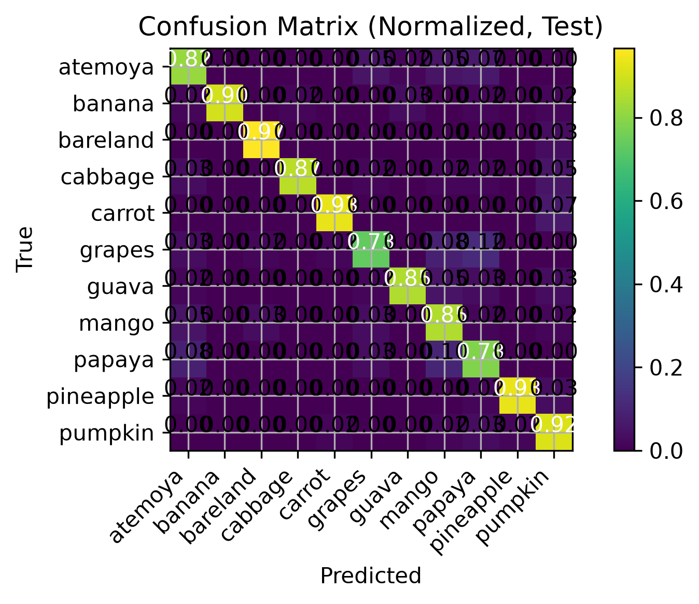

# Crop Image Classification using Convolutional Neural Networks (PyTorch)

## Project Overview

This project implements an image classification model using PyTorch to classify crop images into 11 categories. The project covers the complete deep learning workflow, including data preprocessing, model training, evaluation, and visualization.

Several training strategies were incorporated to improve model performance, including Residual Blocks, Test Time Augmentation (TTA), Partial Label Smoothing, Cosine Annealing Learning Rate Scheduler, and Early Stopping.

---

## Features

- PyTorch implementation
- Custom CNN architecture
- Residual Block
- Data Augmentation
- Test Time Augmentation (TTA)
- Partial Label Smoothing
- Cosine Annealing Learning Rate Scheduler
- Early Stopping
- Confusion Matrix
- Classification Report
- Training & Validation Curves

---

## Dataset

The dataset contains **11 crop categories**.

> **Note:** The dataset is not included in this repository because of its size. Place the dataset inside:

```text
crops_image/
```

---

## Results

### Test Performance

| Metric | Value |
|--------|-------|
| Accuracy | **94.32%** |
| Macro F1-score | **94.25%** |
| Weighted F1-score | **94.25%** |

### Loss Curve



### Accuracy Curve



### Confusion Matrix



### Normalized Confusion Matrix



---

## Repository Structure

```text
crop-image-classification-cnn/
├── .gitignore
├── README.md
├── requirements.txt
├── crop_image_classification.ipynb
└── figures/
    ├── loss_curve.png
    ├── accuracy_curve.png
    ├── confusion_matrix_test.png
    └── confusion_matrix_normalized.png
```

---

## Installation

```bash
git clone https://github.com/ziyingyang519/crop-image-classification-cnn.git

cd crop-image-classification-cnn

pip install -r requirements.txt
```

---

## Usage

Open the notebook:

```text
crop_image_classification.ipynb
```

Run all cells to train and evaluate the model.

---

## Future Improvements

- Experiment with transfer learning models (ResNet, EfficientNet, Vision Transformer)
- Hyperparameter optimization
- Larger and more diverse datasets
- Model deployment using Streamlit or Gradio

---

## Technologies

- Python
- PyTorch
- torchvision
- NumPy
- Pandas
- Matplotlib
- scikit-learn